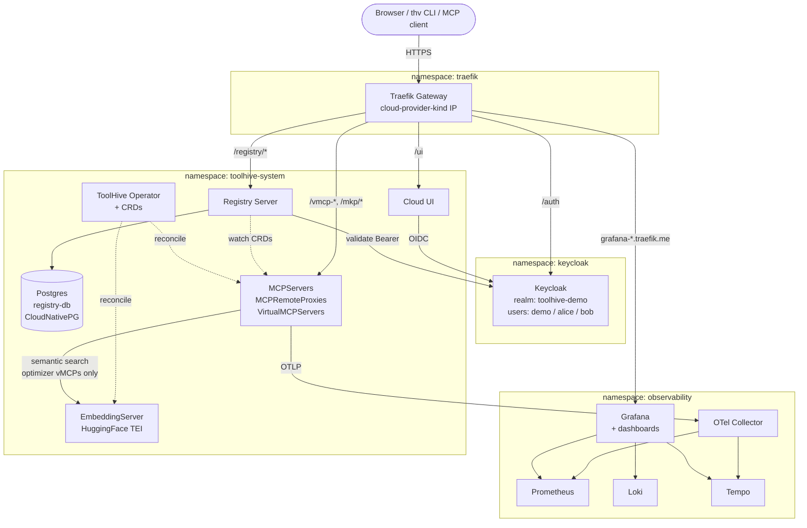
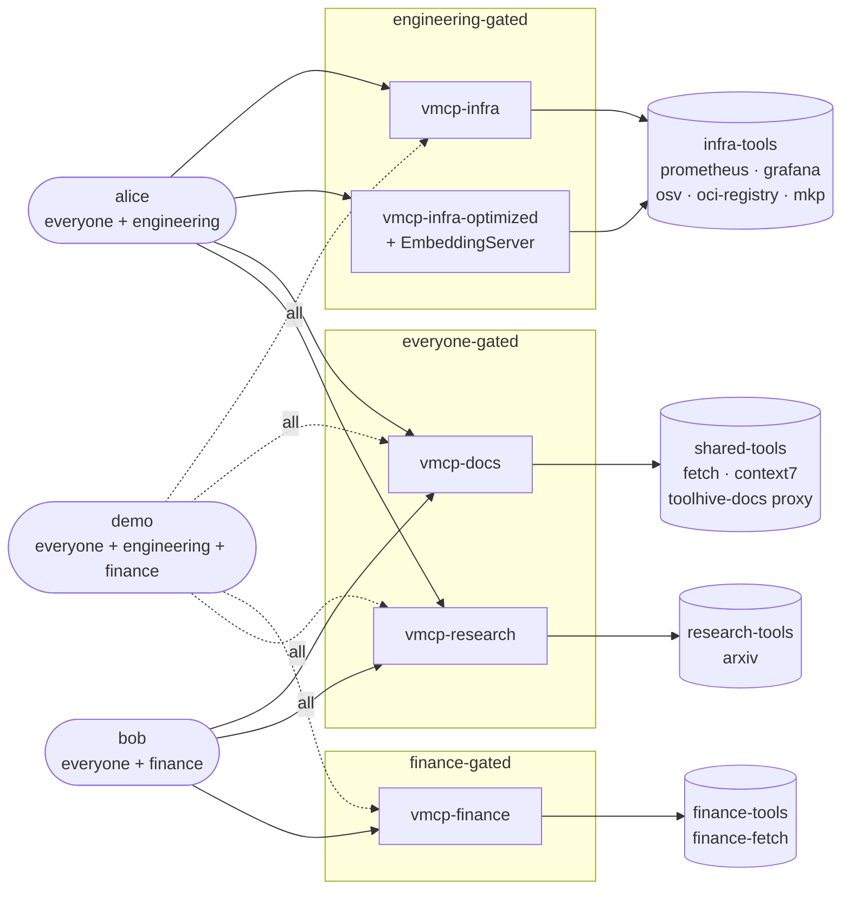
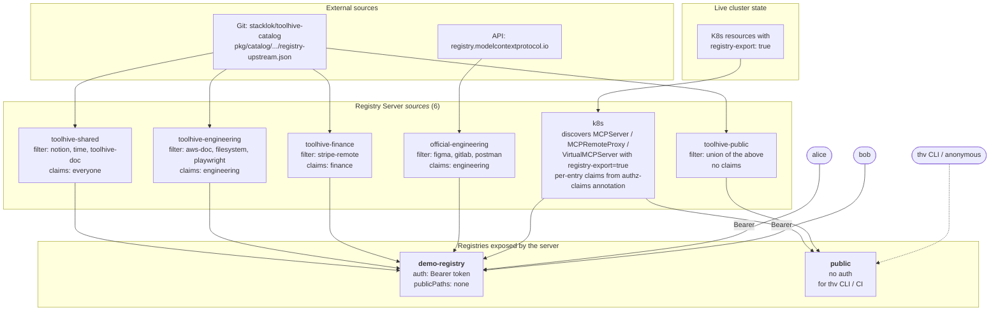
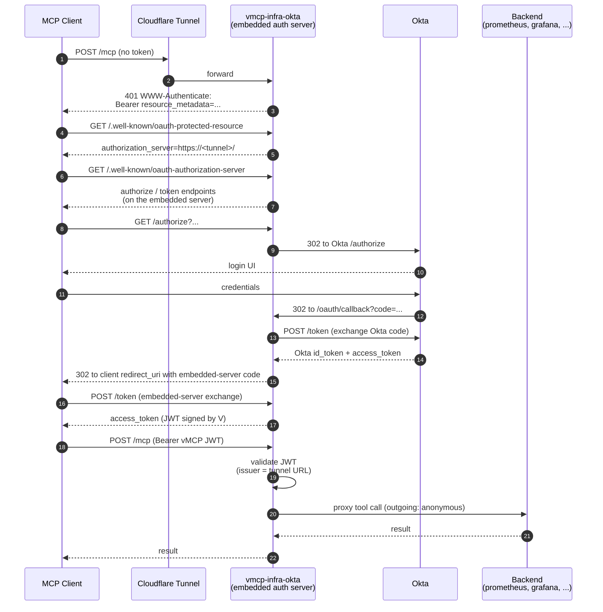

# Architecture

This repo stands up a complete ToolHive platform — operator, registry, cloud UI, Keycloak, observability, and a set of persona-scoped MCP gateways — inside a single local `kind` cluster. `./bootstrap.sh` assembles it in one shot, but the moving parts and how they relate can take a minute to hold in your head.

This doc is here to help with that. It's organized as four diagrams, each zoomed in on a different slice of the system rather than one sprawling overview:

1. **[Cluster at a glance](#1-cluster-at-a-glance)** — what's deployed where, and who talks to whom at runtime
2. **[Persona, group, and gateway model](#2-persona-group-and-gateway-model)** — how users map to MCP gateways and backends
3. **[How the registry gets its content](#3-how-the-registry-gets-its-content)** — the six sources that feed the two registries, and how group claims gate visibility
4. **[OAuth flow for the Okta-authenticated addon](#4-oauth-flow-for-the-okta-authenticated-addon)** — a sequence diagram of the full embedded-auth-server dance

For setup instructions, see [`README.md`](README.md). If you're modifying the demo, [`CLAUDE.md`](CLAUDE.md) captures the conventions and gotchas worth knowing.

## 1. Cluster at a glance

The demo is a single-node kind cluster. Traefik fronts every externally-reachable endpoint (except the Cloudflare-tunnel addons); Keycloak is the identity provider for the registry and cloud UI; the ToolHive operator reconciles the MCP workloads in `toolhive-system`; and an OTel pipeline captures traces/metrics from every MCP server.

**Bootstrap ordering note:** the Registry Server installs *after* every MCPGroup, MCPServer, MCPRemoteProxy, and VirtualMCPServer has reached `Ready`. Putting it earlier triggered SQLSTATE 40001 serialization storms between the K8s reconciler and the git-source sync loop and sometimes starved sources entirely. See [`CLAUDE.md`](CLAUDE.md#bootstrap-order--dont-reorder-without-care) for the longer story.

## 2. Persona, group, and gateway model

The Keycloak realm ships three users: **`demo`** (all groups, registry superAdmin), **`alice`** (engineering), and **`bob`** (finance). Backends live in MCPGroups; gateways (`VirtualMCPServer`) aggregate one group each. Multiple gateways can share a group — `vmcp-infra` and `vmcp-infra-optimized` both aggregate `infra-tools`, the difference being that the latter references an `EmbeddingServer` and exposes only `find_tool` + `call_tool`.

Gating happens at two layers:

- **Registry visibility** — the `toolhive.stacklok.dev/authz-claims` annotation on a vMCP (or MCPServer / MCPRemoteProxy) decides which authenticated users can *see* it in the registry.
- **Call-time auth** — most gateways are `incomingAuth: anonymous`. Authenticated gateways like `vmcp-infra-okta` (addon) plug in an embedded OAuth authorization server and `incomingAuth: oidc`.

## 3. How the registry gets its content

This is the trickiest mental model in the demo. The Registry Server pulls from **six configured sources**, combines them into **two named registries**, and applies per-source claims to decide who sees what. There's also a single standalone route (`/mkp/mcp`) that lives outside the registry entirely — available to anyone who knows the URL.

**Per-entry filtering on the K8s source** is why `alice` and `bob` see different things in the same `demo-registry`: every MCPServer / MCPRemoteProxy / VirtualMCPServer carries an `authz-claims` annotation that the server matches against the user's group claim from Keycloak. `demo` is a `superAdmin` in the registry's authz config so they see everything regardless. The `public` registry reuses the same `k8s` source but is queried unauthenticated, so claim-based filtering doesn't apply there — every `registry-export=true` K8s resource is visible.

**Notable non-source:** the standalone `mkp` workload has its own HTTPRoute at `/mkp/mcp` and is *also* in `infra-tools`, so it shows up twice — once as a direct standalone entry, once inside `vmcp-infra`'s aggregated tool list.

## 4. OAuth flow for the Okta-authenticated addon

The `vmcp-infra-okta` addon is the most interesting auth topology in the repo. The vMCP runs its own embedded OAuth authorization server (thanks to the operator) and delegates the actual login to Okta. MCP clients go through a normal RFC 9728 discovery → OAuth2 authorization code flow, then present a JWT the vMCP itself signed.

The backend MCPServers in `infra-tools` don't know anything about Okta — the vMCP handles all the token validation and forwards calls anonymously. Adding per-backend identity (token exchange to a downstream IdP) is what `MCPExternalAuthConfig` is for, and it slots in at step 16 without affecting anything else in this diagram.

## Where things live

- **[bootstrap.sh](bootstrap.sh)** — apply order, env-var detection, endpoint JSON
- **[demo-manifests/](demo-manifests/)** — MCPGroups, MCPServers, VirtualMCPServers, EmbeddingServer, registry helm values
- **[infra/](infra/)** — cluster-level infra (cert-manager certs, traefik values, keycloak realm import, observability stack, registry Postgres)
- **[addons/](addons/)** — opt-in features (`librechat`, `cloud-ui-openrouter`, `vmcp-infra-okta`). Each self-contained with `deploy.sh` / `teardown.sh` / `.env.example`
- **[local-demos/](local-demos/)** — ad-hoc one-offs not wired into `bootstrap.sh`
